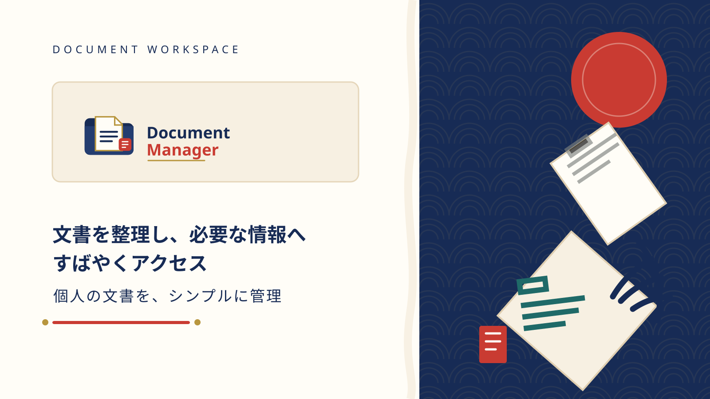

<div align="center">

# Document Manager

学習資料と業務文書をローカルで整理する Avalonia デスクトップアプリケーションです。

[](https://dotnet.microsoft.com/)
[](https://avaloniaui.net/)
[](https://www.sqlite.org/)
[](https://github.com/hayato-shino05/study-document-manager)

[](https://github.com/hayato-shino05/study-document-manager/releases)
[](https://github.com/hayato-shino05/study-document-manager/releases)
[](LICENSE)
[](https://github.com/hayato-shino05/study-document-manager)



</div>

## 目次

- [概要](#概要)
- [主な機能](#主な機能)
- [技術スタック](#技術スタック)
- [セットアップ](#セットアップ)
- [ビルドとテスト](#ビルドとテスト)
- [プロジェクト構成](#プロジェクト構成)
- [貢献](#貢献)
- [ライセンス](#ライセンス)

## 概要

Document Manager は、ローカルの SQLite データベースを使って文書を整理するデスクトップアプリケーションです。検索、分類、期限管理、コレクション管理、レポート表示までを 1 つのアプリケーションで扱えます。

現在の実装は Avalonia 11.2.7 と .NET 9.0 をベースにしており、表示層は MVVM、データ永続化は `Microsoft.Data.Sqlite` を使っています。日本語を既定ロケールとし、言語設定は SQLite の `app_settings` に保存します。

## 主な機能

- 文書の追加、編集、削除、検索、複合フィルター
- カテゴリ、文書タイプ、コレクション、関連文書による整理
- 重要フラグ、期限、個人メモ、ごみ箱による管理
- 一括インポート、重複検出、ファイル整合性確認
- 最近開いた文書、CSV エクスポート、データベースのバックアップと復元
- レポート画面と TreeMap による可視化
- 日本語、英語、ベトナム語、中国語の UI 切り替え
- Dashboard での欠損ファイル修復、launcher 失敗の案内、空の collection の作成と文書追加

## 技術スタック

| 項目 | 内容 |
| --- | --- |
| UI | Avalonia 11.2.7 |
| Runtime | .NET 9.0 |
| Pattern | MVVM (`CommunityToolkit.Mvvm`) |
| DI | `Microsoft.Extensions.DependencyInjection` |
| Database | SQLite (`Microsoft.Data.Sqlite`) |
| Tests | xUnit |

## セットアップ

### 前提条件

- .NET 9 SDK
- Git
- `.NET` デスクトップアプリを扱える開発環境、または `dotnet` CLI

### 取得

```bash
git clone https://github.com/hayato-shino05/study-document-manager.git
cd study-document-manager
```

### 起動

```powershell
dotnet run --project "StudyDocumentManager\StudyDocumentManager.csproj"
```

## ビルドとテスト

```powershell
dotnet build "StudyDocumentManager.sln" -c Debug
dotnet test "StudyDocumentManager.Tests\StudyDocumentManager.Tests.csproj" -c Debug
```

現行のテストスイートは xUnit ベースで、871 件のテストを含みます。データベース、repository、model/service の自動検証を行います。CI は build と test を実行し、Debug/Release の成果物を artifact として保存します。Dashboard の deferred lifecycle、drag/drop の event bridge、native dialog、restore 後の再オープンなど、デスクトップ実行が必要な項目は手動確認の対象です。

## Windows セットアップの作成

利用者向けの setup EXE は self-contained publish から生成します。

```powershell
.\scripts\build-windows-setup.ps1 -Configuration Release
```

生成物:

- publish: `artifacts\publish\win-x64\`
- setup EXE: `artifacts\installer\DocumentManager_v4.0.0_Setup.exe`

この setup は .NET Framework 4.8 を要求せず、`win-x64` 向け自己完結型の Windows アプリとして配布します。

## プロジェクト構成

| プロジェクト | 役割 |
| --- | --- |
| `StudyDocumentManager` | Avalonia UI、画面モデル、サービス、テーマ |
| `StudyDocumentManager.Core` | エンティティ、DTO、契約、共通ロジック |
| `StudyDocumentManager.Data` | SQLite、スキーマ、マイグレーション、リポジトリ |
| `StudyDocumentManager.Tests` | xUnit テスト |

詳細な構成とデータベース仕様は、[PROJECT_STRUCTURE.md](./PROJECT_STRUCTURE.md)、[DATABASE.md](./DATABASE.md)、[CONTRIBUTING.md](./CONTRIBUTING.md) を参照してください。

## 貢献

開発フロー、ビルド、テスト、PR 作成のガイドは [CONTRIBUTING.md](./CONTRIBUTING.md) を参照してください。

## ライセンス

このプロジェクトは [MIT License](./LICENSE) の下で公開しています。
